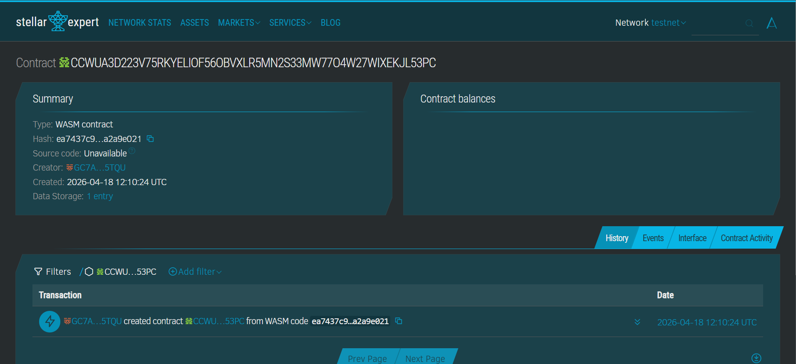
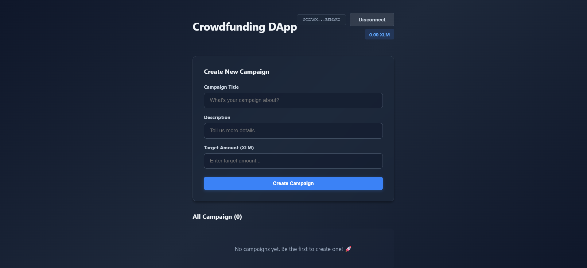

# Stellar Crowdfunding DApp

**Stellar Crowdfunding DApp** - Blockchain-Based Decentralized Fundraising Platform

## Project Description

Stellar Crowdfunding DApp is a decentralized fundraising platform built on the Stellar blockchain using the Soroban Smart Contract SDK. It enables individuals and organizations to create transparent and trustless crowdfunding campaigns without relying on centralized intermediaries.

The platform allows users to create campaigns, contribute funds, and track campaign progress directly on-chain. All transactions and campaign data are stored immutably on the blockchain, ensuring transparency, security, and accountability.

Each campaign contains essential information such as title, description, funding goal, deadline, and creator address.

---

## Project Vision

Our vision is to transform the way people raise and contribute funds by:

- **Eliminating Intermediaries**: Removing centralized platforms and enabling direct peer-to-peer funding  
- **Ensuring Transparency**: Making all transactions publicly verifiable on the blockchain  
- **Empowering Creators**: Giving full control of fundraising campaigns to their creators  
- **Building Trustless Systems**: Ensuring funds are managed by smart contracts, not organizations  
- **Promoting Global Access**: Allowing anyone with a wallet to participate without restrictions  

---

## Key Features

### 1. Campaign Creation

- Create crowdfunding campaigns via smart contract  
- Define title, description, funding goal, and deadline  
- Automatic campaign ID generation  
- Persistent on-chain storage  

### 2. Fund Contribution

- Users can contribute directly to campaigns  
- Secure and transparent transactions  
- Real-time campaign balance updates  
- No intermediaries or hidden fees  

### 3. Campaign Retrieval

- Fetch all campaigns in a single call  
- Structured data for frontend integration  
- View campaign details and progress  
- Real-time synchronization with blockchain  

### 4. Transparency and Security

- Publicly verifiable transactions  
- Immutable campaign records  
- Protection against data manipulation  
- Smart contract-based fund management  

### 5. Stellar Network Integration

- Fast and low-cost transactions  
- Built using Soroban Smart Contracts  
- Scalable architecture  
- Compatible with Stellar wallets  

---

## Contract Details

Contract Address: CCVJA5V54BOXSSRP74NOLEH7NOH3LDDYMBRTZWHJ3L7SERLH6VPSZ6WA  

---

## Frontend Preview

---

## Future Scope

### Short-Term Enhancements

1. Campaign editing before deadline  
2. Contribution history tracking  
3. Campaign progress indicators  
4. Deadline validation  

### Medium-Term Development

5. Refund mechanism for failed campaigns  
6. Multi-currency support  
7. Campaign categorization  
8. Notification system  

### Long-Term Vision

9. DAO-based crowdfunding  
10. Cross-chain integration  
11. Decentralized storage (IPFS)  
12. Reputation system  
13. AI-based campaign insights  
14. Decentralized identity (DID) integration  

### Enterprise Features

15. Corporate fundraising solutions  
16. Audit and compliance tracking  
17. Automated fund distribution  
18. Multi-language support  

---

## Technical Requirements

- Soroban SDK  
- Rust programming language  
- Stellar blockchain network  
- Freighter wallet  

---

## Getting Started

Deploy the smart contract to Stellar Soroban Testnet and interact using the following functions:

- `create_campaign()` - Create a new campaign  
- `get_campaigns()` - Retrieve all campaigns  
- `contribute()` - Contribute to a campaign  

---

**Stellar Crowdfunding DApp** - Decentralizing Fundraising on the Blockchain